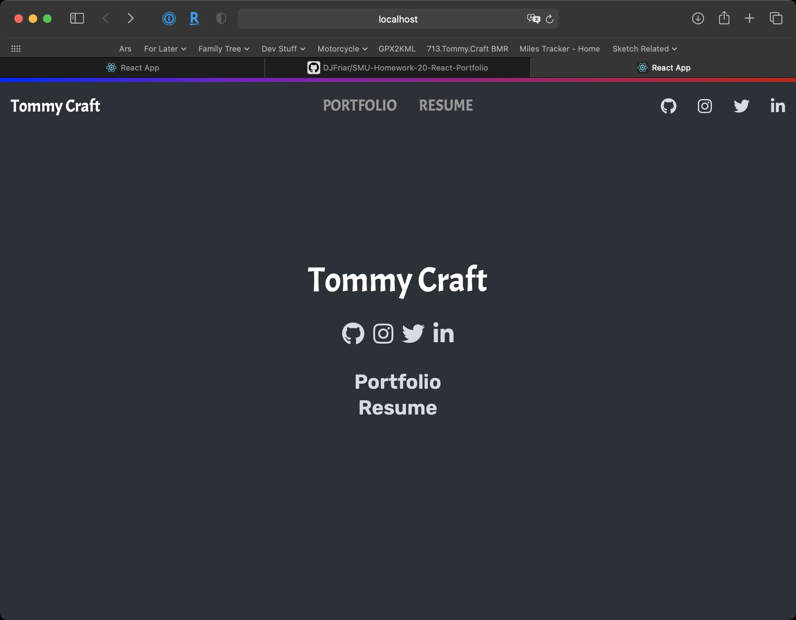

# SMU-Homework-20-React-Portfolio

## Description

A React based version of my personal portfolio site. NOTE: GH-Pages badly mangled the site. See screenshot for what it looks like while being developed, and then click the link above the screenshot to see how poorly gh-pages rendered it.

## Installation

Clone the repo and use ```npm install``` to configure.

## Screenshot

View the gh-pages site [here](https://djfriar.github.io/SMU-Homework-20-React-Portfolio/)

